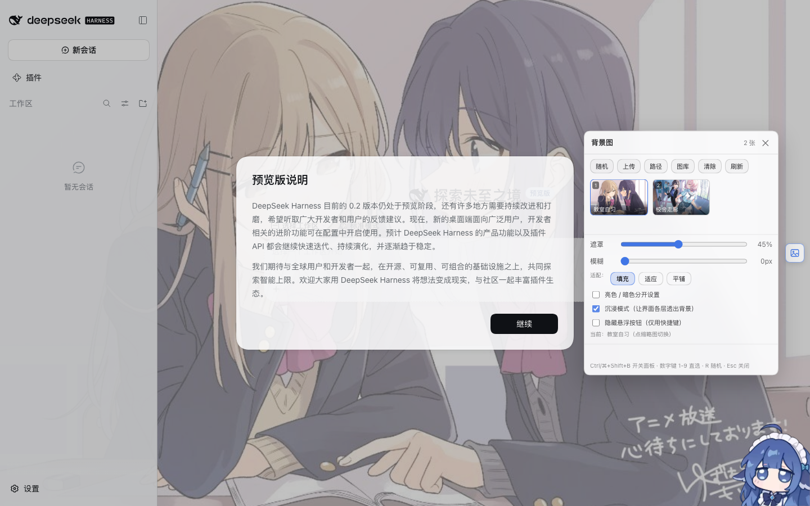

# dsh-bg-switcher · DSH 背景图快捷切换

给 DeepSeek Harness Web GUI 加一个"换壁纸"插件：右下角一个悬浮按钮 + 缩略图面板，
点一下就能换背景图；支持随机轮播（可设间隔）、换图交叉淡入、鼠标视差、亮/暗色分别设置、遮罩与模糊调节、快捷键、上传与本机路径导入。
设置存在 profile 里（桌面端每次启动都是随机端口，localStorage 会随 origin 失效，所以以服务端为准）。

支持 macOS 和 Windows，分别使用 `install.sh` 和 `install.ps1` 安装。



## 特性

| 能力 | 说明 |
|---|---|
| 悬浮按钮 + 面板 | 右侧中部一个半透明按钮，点开就是缩略图墙（可长按拖动挪位置） |
| 快捷键 | `Ctrl/⌘+Shift+B` 开关面板 · 数字键 `1`-`9` 直选 · `R` 随机 · `Esc` 关闭 · 面板内方向键 + `Enter` |
| 图库 | 内置图（包内 `assets/backgrounds/`）+ 用户图库（`<profile>/data/dsh-bg-switcher/backgrounds/`） |
| 快速加图 | 面板里「上传」（浏览器选图，base64 落盘）或「路径」（粘贴本机绝对路径，服务端复制进图库） |
| 沉浸模式 | 把外壳各层底色换成半透明（`--dsw-alias-bg-*` / `--dsw-specific-*`），背景图透上来；关掉则只贴 body，配合皮肤用 |
| 遮罩 / 模糊 | 遮罩 0-100%（保证文字可读），模糊 0-24px（对 `#root` 做 `backdrop-filter`） |
| **随机轮播** | 可设间隔（1-720 分钟）、随机或按顺序；面板显示「下一张 mm:ss」倒计时；页面不可见时不推进（省电），手动选图会重新起算 |
| **交叉淡入** | 换图时两层壁纸交叉淡入（480ms）；先预加载再淡入，大图不会淡到一半还在下载；`prefers-reduced-motion` 下自动变瞬时 |
| **视差** | 鼠标在窗口里移动时壁纸轻微位移（±14px，`translate3d` + 0.35s 缓动），离开窗口回中；可关，系统"减少动态效果"时自动禁用 |
| 适配模式 | 填充 cover / 适应 contain / 平铺 tile |
| 亮暗分开 | 开 `split` 后，亮色与暗色主题各记一张图，主题切换自动换（`data-ds-dark-theme` 变化即时响应） |
| 缩略图 | macOS 上用系统 `sips` 懒生成 480px 缩略图并缓存，3MB 大图也不会拖慢面板 |
| 持久化 | `settings.json` 落盘 + 首页注入快照（`__DSH_BG_INITIAL__`），刷新页面不闪白 |

## 安装

### macOS / Linux

```bash
bash install.sh            # 自动挑 profile：有 profiles/desktop 就用它（官方桌面端），否则 web（社区版）
bash install.sh desktop    # 也可以显式指定 profile 名
```

### Windows

```powershell
powershell -NoProfile -ExecutionPolicy Bypass -File install.ps1
powershell -NoProfile -ExecutionPolicy Bypass -File install.ps1 -Profile desktop
```

Windows 版脚本会自动：备份 → 拷贝插件 → 在 `node_modules` 下建 **junction**（不需要管理员/开发者模式；失败则改为复制一份）→ 改 `package.json`（依赖 + `dsh.profile.bundles`）→ 补 `pnpm-lock.yaml` → 用 `node` 自检一次。
写 `package.json` 时特意用**无 BOM 的 UTF-8**（PowerShell 5.1 的 `Set-Content -Encoding UTF8` 会写 BOM，而宿主用 `JSON.parse` 读它，会直接解析失败）。

不想用脚本的话，手动三步等价于：

1. 把 `dsh-bg-switcher` 拷到 `%USERPROFILE%\.dsh\profiles\<profile>\.local-plugins\dsh-bg-switcher`
2. **复制**一份到 `...\profiles\<profile>\node_modules\dsh-bg-switcher`（Windows 建目录软链要开发者模式/管理员权限，复制就绕开了）
3. `...\profiles\<profile>\package.json`：`dependencies` 里加 `"dsh-bg-switcher": "link:.local-plugins/dsh-bg-switcher"`，`dsh.profile.bundles` 里加 `"dsh-bg-switcher"`

### 脚本做的事（两个平台一致，等价于 `dsh plugin --profile <name> add link:<本目录>`）

1. 备份 `<profile>/package.json` 与 `pnpm-lock.yaml`（`*.bak-before-dsh-bg-switcher`）
2. 拷贝插件到 `<profile>/.local-plugins/dsh-bg-switcher`（排除 `test/`、`tools/`）
3. 让 Node 能解析到它：macOS/Linux 建软链、Windows 建 junction（失败则复制）
4. 给 `package.json` 加 `dependencies` 条目并把包名放进 `dsh.profile.bundles`（**bundles 才是"启用"**）
5. 补 `pnpm-lock.yaml` 的 importer 条目
6. 自检：`import()` 一次装好的模块，确认导出形状

**装完必须重启 DSH**（官方打包版没有 ⌘R，菜单里也没有"重新加载"，只能退出并重开应用）。
重启后右侧中部出现背景图按钮，`Ctrl/⌘+Shift+B` 也能开面板。

卸载：`bash uninstall.sh` / `powershell -NoProfile -ExecutionPolicy Bypass -File uninstall.ps1`
（保留图库与设置；加 `--purge` / `-Purge` 连数据一起删）。

### 缩略图（跨平台）

面板里的缩略图由**系统自带工具**生成，不需要任何 npm 依赖：

| 平台 | 引擎 |
|---|---|
| macOS | `sips`（自带） |
| Windows | PowerShell + `System.Drawing`（Win10/11 自带；WebP 之类它读不了的格式会回落到原图） |
| Linux | `magick` / `convert` / `ffmpeg`，有哪个用哪个 |

一个都用不了时 `/thumb` 直接回原图 —— 面板照常可用，只是大图会慢些。
可用环境变量强制指定或关掉：`DSH_BG_THUMB_ENGINE=sips|powershell|magick|convert|ffmpeg|none`。

## 官方版桌面端（@deepseek-ai/dsh-desktop 0.2.0-rc.2）

官方版和社区版有三处关键差异，插件里都做了适配：

| 差异 | 插件怎么处理 |
|---|---|
| 页面跑在 `dsh-app://app/` 自定义协议下（不是 http 同源） | 宿主把绝对地址塞进注入行（`window.__DSH_BG_API__`），页面侧非 http(s) 协议时优先用它，失败再自动回落到相对路径 |
| profile 叫 `desktop`，且 `DSH_DESKTOP_PROFILE` 不设 | 先用宿主注入的 `DSH_PROFILE_DIR`，再按插件自身位置反推 `<DSH_HOME>/profiles/<name>/...` |
| 官方前端把 body 背景设成 `transparent`，外壳各层吃 `--dsw-alias-bg-*` | 沿用同一套 token 覆盖（`!important`），并把内容层遮罩做成 0-100% 可调 |

另外针对"壁纸明明选了却不显示"的三类坑：

- **官方前端的 macOS 规则抢权重**：`html[data-platform=darwin] body{background:transparent}`
  权重 (0,1,2) 高过 `body[data-dsh-bg]` (0,1,1)，且是 `background` 简写，会把背景图整条重置成 `none`。
  症状很迷惑：`#root` 的遮罩/模糊/沉浸 token 都生效，偏偏壁纸不出现。所以插件那组 body 背景声明
  一律带 `!important`，测试里也有断言守着（`tools/probe-render.sh` 会复刻这条规则做回归）。


- **遮罩被拉满**：`遮罩 = 100%` 等于用不透明底色把壁纸整个盖住。插件在启动时发现 `dim ≥ 95` 会
  自动调回 45%、落盘并在面板里说明；面板里滑块接近拉满时也会变红提示。
- **`settings.json` 写坏**：解析失败时把坏文件挪成 `settings.json.bad-<时间>` 再回落默认值（留痕，不再"选区悄悄消失"）。
- **插件被摘出 bundles**：官方桌面端的插件管理器/手动编辑可能把包名从 `dsh.profile.bundles` 里去掉，
  这时宿主根本不会加载插件（路由 404、页面上没有按钮）。`install.sh` 每次都会把包名加回 bundles。

排查手段：

```bash
bash tools/verify-official.sh   # 官方桌面端验收：路由 + 页面自检回报 + 遮罩检查
bash tools/probe-render.sh      # 用官方 harness 起一次性实例，headless Chrome 真渲染 + 截图
```

面板里点「诊断」会把页面真实状态（计算样式、盖在中心的元素栈、图片是否加载成功）POST 回宿主，
落盘在 `<profile>/data/dsh-bg-switcher/diag.json`，专门用来定位"插件在跑但壁纸不显示"。

## 使用

- 面板里点缩略图即刻换图；当前生效的那张有蓝框与序号角标。
- 「上传」选本机图片；「路径」把本机任意位置的图片复制进图库；「图库」用文件管理器打开图库目录。
- 用户图右上角有 `✕` 可删除（内置图不可删）。
- 「清除」取消背景；「随机」从图库里随机挑一张（不会重复当前那张）。
- 勾「隐藏悬浮按钮」后只剩快捷键：`Ctrl/⌘+Shift+B` 打开面板。

## 壁纸是怎么画的（改渲染前先看这段）

图**不是**贴在 `body` 上的，而是放在 `body` 第一个子节点 `[data-dsh-bg-stage]` 里的**两层** `[data-dsh-bg-slide]` 上：

```html
<body data-dsh-bg data-dsh-bg-immersive>
  <div data-dsh-bg-stage>              <!-- position:fixed; inset:-3%; z-index:-1 -->
    <div data-dsh-bg-slide="a"></div>  <!-- 两层用来交叉淡入；inset:-3% 给视差留位移余量 -->
    <div data-dsh-bg-slide="b"></div>
  </div>
  <div id="root">…</div>               <!-- 它的 background 就是遮罩，天然压在图之上 -->
</body>
```

- `z-index:-1` 让舞台落在 **body 底色之上、所有内容之下**；`#root` 的背景（遮罩）自然盖在图上层，层级不用额外维护。
- `body` 只保留 `background-color`，而且必须 `!important`：官方 macOS 上有 `html[data-platform=darwin] body{background:transparent}`，权重 (0,1,2) 比 `body[data-dsh-bg]` (0,1,1) 高。
- **只有两层才能做交叉淡入与视差**，这也是从"body 贴图"迁到舞台两层的原因；换图时先 `new Image()` 预加载，再 `opacity` 互换，最后清掉旧层的 `background-image`。

## 目录结构

```
dsh-bg-switcher/
├── lib/index.js        # 宿主半区：图库清单 / 图片与缩略图字节流 / 设置落盘 / index 注入
├── lib/widget.js       # 浏览器半区：悬浮按钮、面板、快捷键、贴图（自包含普通脚本）
├── assets/backgrounds/ # 内置背景图（随包发布）
├── cordis.patch.yml    # bundle patch：把自己插进 web profile 的配置树
├── test/               # node --test 测试（不随安装拷贝）
├── tools/              # 沙盒验收脚本（不随安装拷贝）
├── install.sh / uninstall.sh
└── package.json
```

数据文件（跟随 profile，不进包）：

```
<profile>/data/dsh-bg-switcher/
├── backgrounds/   # 用户图库（拖进去的文件也会被自动识别）
├── thumbs/        # sips 生成的缩略图缓存
└── settings.json  # 选区、遮罩、模糊、适配、亮暗分开、悬浮按钮坐标
```

## HTTP 接口

全部挂在 `/dsh-bg/` 下，只服务回环来源（非回环 Host 会先问宿主 `connection.requestRejection`，
再回落到插件自带的同源/非跨站校验，任何异常都按拒绝处理）：

| 方法 | 路径 | 作用 |
|---|---|---|
| GET | `/dsh-bg/list` | 图库清单 + 当前设置 |
| GET | `/dsh-bg/img?id=` | 原图字节（带 MIME） |
| GET | `/dsh-bg/thumb?id=` | 缩略图（macOS 走 sips，失败回落原图） |
| GET/PUT | `/dsh-bg/settings` | 读 / 写设置（服务端做范围与白名单清洗） |
| POST | `/dsh-bg/upload` | `{name, dataUrl}` 入库 |
| POST | `/dsh-bg/add-path` | `{path}` 复制本机图片入库（支持 `~` 与 `file://`） |
| POST | `/dsh-bg/delete` | `{id}` 删除用户图（内置图拒绝） |
| POST | `/dsh-bg/reveal` | 打开图库目录 |
| GET | `/dsh-bg/widget.js` | 浏览器半区脚本 |

id 形如 `builtin:教室自习.jpg` / `user:我的图.webp`，服务端只认"纯文件名"，`../`、绝对路径、目录分隔符一律拒绝。

## 排障

插件支持一份可选的运行痕迹（不设环境变量时完全是空操作）：

```bash
DSH_BG_TRACE=/tmp/bg.log <启动 dsh web 的命令>
```

会记录 `apply()` 进入、注入行推送、webServer 注入、路由补齐（含实例端口）、被栅栏拒绝的请求等。

其它排查点：

- 界面没出现按钮：先看「插件」页面里 `dsh-bg-switcher` 是否在已启用列表，再确认重启过 Harness。
- 面板能开但图库空：`curl -b <cookie> http://127.0.0.1:<port>/dsh-bg/list` 看是否 200；
  404 说明宿主路由没挂上（看 trace）。
- 图裂开：`/dsh-bg/thumb` 404 → 该 id 不在图库里（文件被删/改名），点「刷新」重读清单。

## 测试

```bash
node --test test/server.test.mjs test/widget.test.mjs   # 78 项：宿主半区 + 浏览器半区（含轮播/淡入/视差）
bash tools/verify-sandbox.sh                            # 临时 DSH_HOME 起一次性 harness，8 项端到端
bash tools/probe-render.sh                              # 官方 harness + headless Chrome 真渲染：12 项断言 + 截图
bash tools/verify-official.sh                           # 官方桌面端：路由 + 页面自检 + 遮罩
bash tools/verify-live.sh                               # 社区版 DSH Desktop（从它的日志取 token）
```

> 官方版把 node 从 PATH 里拿掉了：测试/脚本需要 `node`，可用官方 runtime 的垫片
> `DSH_DESKTOP_NODE_EXECUTABLE="/Applications/DeepSeek Harness.app/Contents/MacOS/DeepSeek Harness" \
> /Applications/DeepSeek\ Harness.app/Contents/Resources/runtime/bin/node --test ...`

`test/dom-stub.mjs` 是一个最小 DOM 替身，让 `lib/widget.js` 能真的在 Node 里跑起来
（引导、贴图、面板、快捷键、亮暗切换、保存防抖都会被断言），不断言 CSS 视觉效果。
两个 verify 脚本都从日志里取 Harness URL 与 token，注意 `BASE` 要去掉结尾斜杠——
`curl "$BASE/path"` 一旦拼成 `//path`，会被 `new URL()` 当成 authority 解析成 `/path`，
看起来就像"路由 404"。

## 版权

插件代码采用 [MIT 许可证](LICENSE)。内置的两张背景图来自用户提供的素材，仅作本机壁纸使用；图片及预览图中的原始素材版权归各自权利人所有，不包含在代码的 MIT 授权范围内。

## 发布（维护者备注）

本仓库就是一个 DSH bundle 插件，发布新版本只需三步：

```bash
# 1) 改版本号（package.json 的 version）
# 2) 提交并打 tag
git add -A && git commit -m "dsh-bg-switcher v0.2.1"
git tag v0.2.1 && git push origin main --tags
# 3) 在 GitHub 上把它标成 Release（可选，但别人更容易看到）
```

别人安装（三种方式任选）：

```bash
# A. 克隆后跑安装脚本
git clone https://github.com/LHXB111/dsh-bg-switcher.git
cd dsh-bg-switcher && bash install.sh          # Windows: powershell -NoProfile -ExecutionPolicy Bypass -File install.ps1

# B. 用 DSH 自带的插件安装入口（社区版桌面端的「插件」页支持这种 spec）
dsh plugin --profile desktop add github:LHXB111/dsh-bg-switcher

# C. 直接下 zip 解压后跑安装脚本
```

注意：**`package.json` 里的 `private: true` 只影响 npm 发布，不影响从 GitHub 安装**；
如果以后要发 npm，删掉 `private` 并确认包名没被占用即可。
